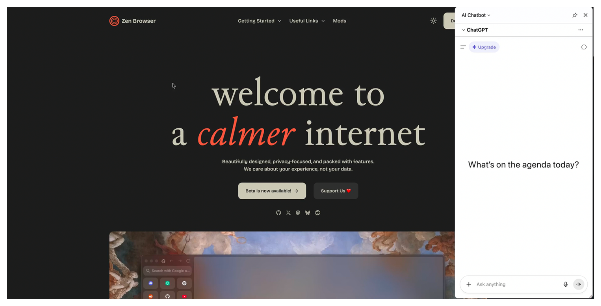

## How to use
  1. Install fx-autoconfig https://github.com/MrOtherGuy/fx-autoconfig
  2. copy the `sidebar_tweaks.uc.mjs` and `sidebar_styles.mjs` into JS folder.
  3. make sure `browser.ml.chat.enabled` is set to true in `about:config` to use the AI chat bots.
  4. make sure "import-button" tooltip is being placed in your desired location (or other unused tooltip button - but change it's id) ,it will act as toggle button.
  -  to get id of a tooltip, use browser toolbox - inspect and get it's id - change it in `toggleButton` const value.
  - the toggle button icon you used will be replaced automatically to sidebar one.
  7. change the shortcut  to the desired one, just make sure it won't colldie with other shortcuts.

## Demo
